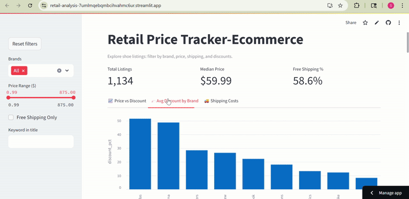

# Retail Price Tracker — Ecommerce
> Skills: Python, Selenium, BeautifulSoup, Pandas, Data Cleaning, Streamlit, Data Visualization, Web Scraping, ETL Pipeline, Dashboard Deployment
Track shoe listings with data crawling, cleaning, visualization, and deployment.
--- 
# Demo

  
---
## Project Highlights

- ✨ **Full Cycle**: From crawling raw data to a live deployed dashboard  
- 🚀 **Automated Web Scraping**: Collects live listings using Selenium  
- 📊 **Clean ETL Pipeline**: Transforms messy raw HTML data into analysis-ready CSV  
- 🔹 **Interactive Dashboard**: Filters by brand, price range, free shipping, and keyword search  
-    **View Dashboard**:: https://retail-analysis-7umlmqebqmbcihvahmc6ur.streamlit.app/

